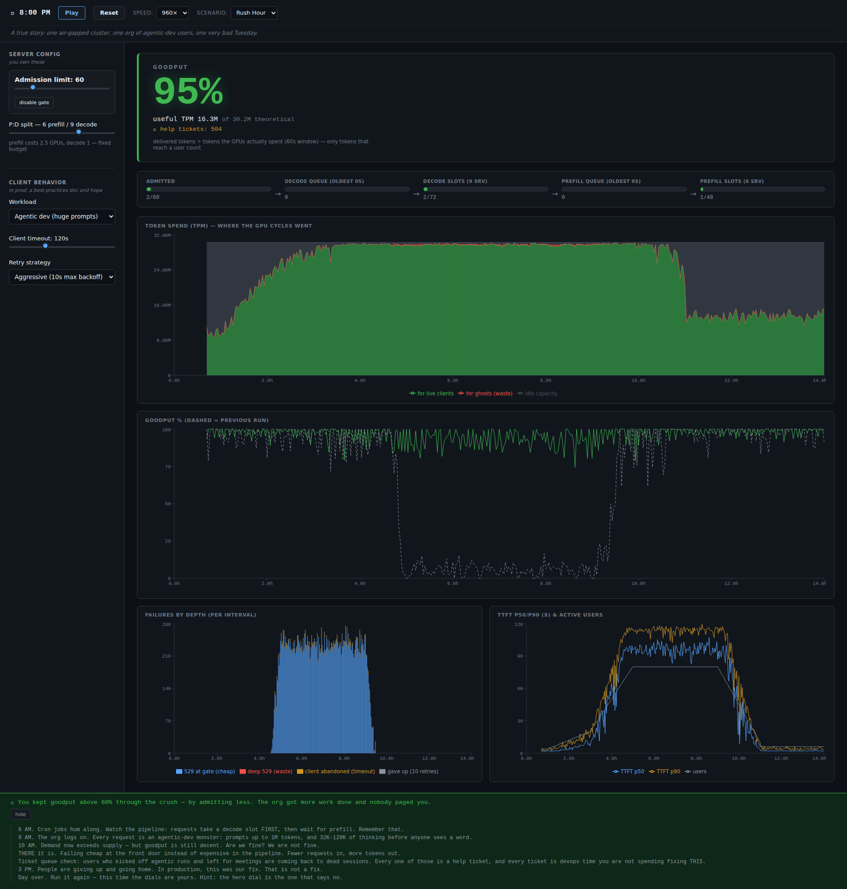

# The Goodput Simulator

When I deployed a frontier lab's latest large language model onto a minimum stack in an airgap environment with far more demand than supply could service, we experienced interesting behaviors where the actual amount of token output would decrease significantly below the theoretical tokens per minute the model should be able to handle. This cause use to dial many of the parameters we could control to limit the amount of wasted model cycles and maintain a maximum amount of “Good (in)put tokens”. 
We as the devops team defined wasted model cycles when a user request caused GPU cycles to be used (Prefill or Decode/Sample) but did not result in the user’s client from receiving a generated response. This could be from either a client read timeout because the time to first token (TTFT) exceeding the user’s threshold or queue times between prefill and sample exceeding timeouts.  In either case this resulted in the user retrying their request, which could lead to a retry storm causing further degradation of the system.
This simulator exists to enable to tweak those dials and see how it effectively they can tune the system based on a variety of user workloads.

## Live demo

**https://ragnarotech.github.io/bad_token_output/** — static, no install, no keys. Press Play.



## What you're looking at

Goodput is not throughput: a GPU can be running flat out on decode and prefill and still deliver almost nothing useful, because throughput counts every token computed while goodput only counts tokens that actually reach a client before it gives up. The collapse in the screenshot above is a slot-holding cascade — decode holds a slot for the entire generation, so once decode saturates, prefill work piles up behind it, wait times blow past client timeouts, and the GPU cycles spent on those doomed requests become pure waste. The admission limit dial is the one lever that fixes this: reject excess requests cheaply at the door (a 529 before any GPU time is spent) instead of letting them limp through the whole pipeline and die expensively at the end.

## Local dev

```bash
npm install
npm run dev
```

## Test

```bash
npm test
```

33 tests across the engine, scenarios, and UI layers, including the collapse invariants that guard the admission-gate behavior described above.

## Docs

The design spec and implementation plan this was built from live under `docs/superpowers/`:

- [`docs/superpowers/specs/2026-08-30-goodput-simulator-design.md`](docs/superpowers/specs/2026-08-30-goodput-simulator-design.md)
- [`docs/superpowers/plans/2026-08-30-goodput-simulator.md`](docs/superpowers/plans/2026-08-30-goodput-simulator.md)
